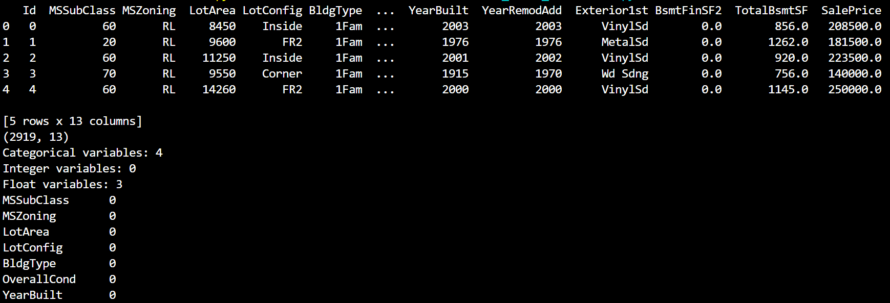
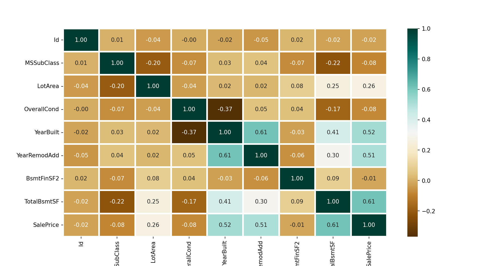
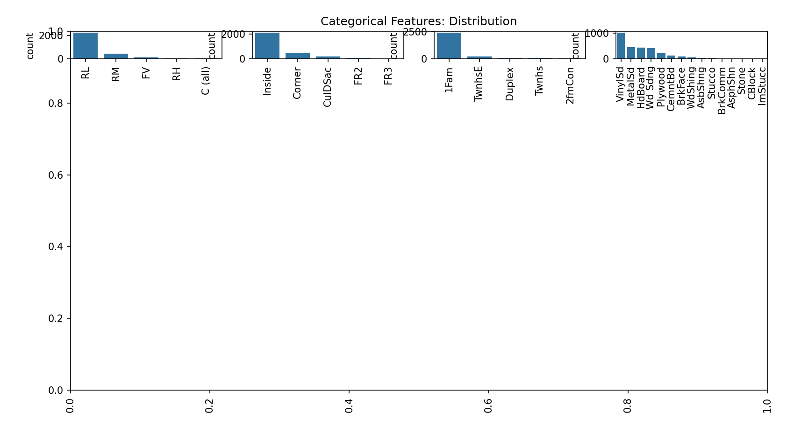

# House Price Prediction

House Price Prediction is a machine learning project that predicts house prices based on various features like area, location, and type of construction. This project implements several regression algorithms and evaluates their performance to provide accurate predictions.






## Features
- Loads dataset from Excel file
- Performs exploratory data analysis (EDA)
- Handles missing values and categorical variables
- Trains multiple regression models (SVR, Random Forest, Linear Regression, CatBoost)
- Evaluates model performance using Mean Absolute Percentage Error (MAPE) and R2 score
- Generates visualizations including correlation heatmap and distribution plots

## Requirements
- Python 3.x
- pandas
- scikit-learn
- seaborn
- matplotlib
- catboost
  
## Usage
1. **Clone the repository:**
   ```sh
   git clone https://github.com/mohammadhashim135/home-price-prediction.git
   cd home-price-prediction
2. **Install required libraries:**
   ```sh
   pip install -r requirements.txt
3. **Run the Script:**
   ```sh
    python Home_Price_Prediction.py

## Credits

## Author

[](https://youtube.com/@ByteMazeHashim?si=5vcrIglNQO8i9Ram)
- Mohammad Hashim
- Email: hashimmohammad1375@gmail.com
- LinkedIn: [Mohammad Hashim](https://www.linkedin.com/in/mohammad-hashim-07ab362a6)
- YouTube: [ByteMazeHashim](https://youtube.com/@ByteMazeHashim?si=5vcrIglNQO8i9Ram)


## License

This project is licensed under the MIT License. See the [LICENSE](LICENSE) file for details.

